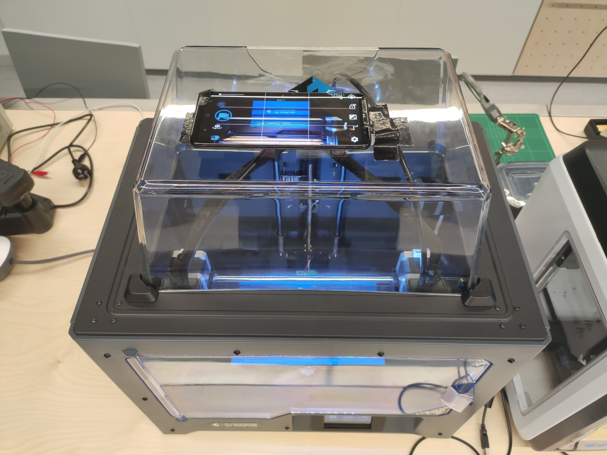
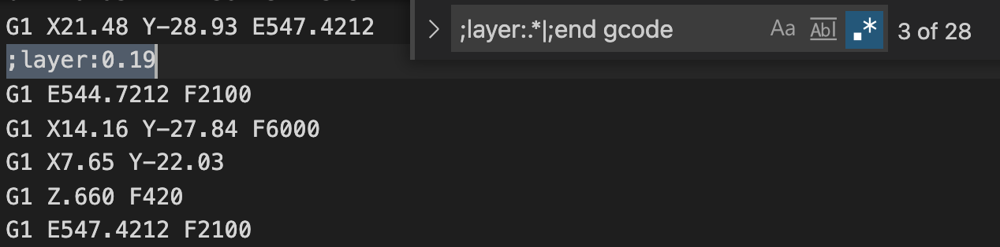
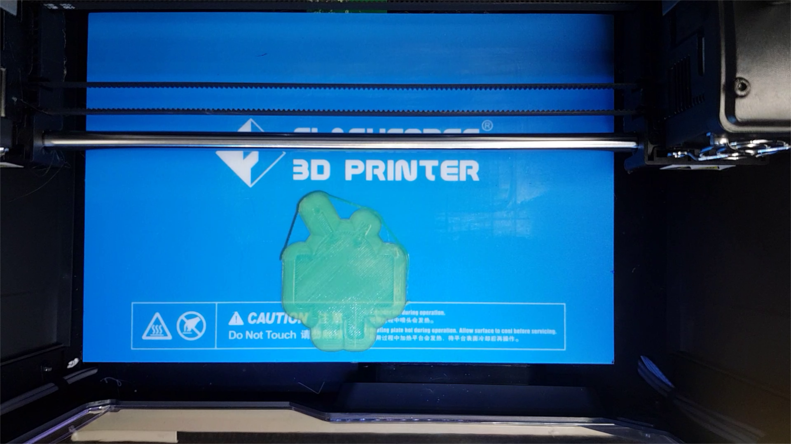
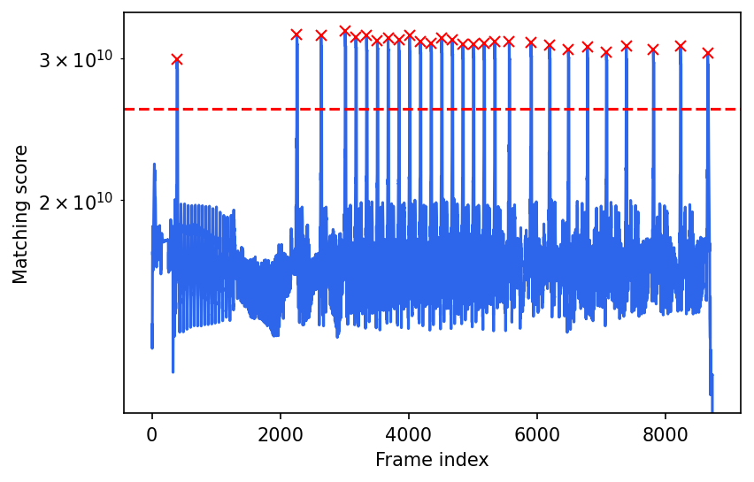
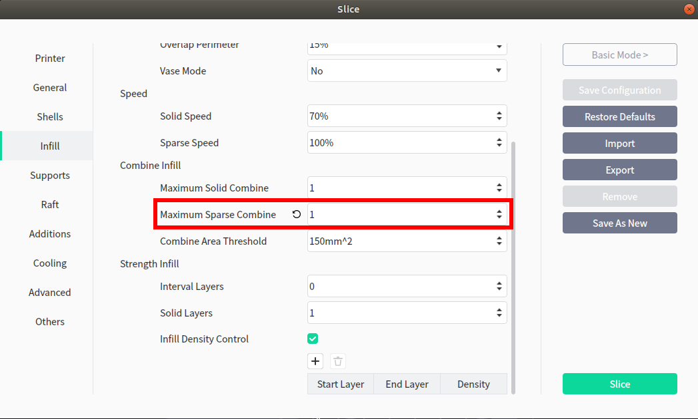

# 3D-print-timelapse
A timelapse tool for 3D printers based on computer vision, without requiring hardware modification. 

### Final outcome
A layer-by-layer timelapse video for a 3D print.


### Discrimination 
Not recommended for TL;NR or beginners who are not familiar with G-Code.

I will not take any responsibility for any damage caused by using this tool. 

### How it works
__The general idea is:__
1. Take a photo after each layer is printed. 
1. Then generate a video showing the model "grows" layer-by-layer.

However, this usually requires hardware and/or firmware modifications to synchronize the 3D printing progress and the camera, which might be time-consuming or not possible for some 3D printers. 

__Therefore, I developed this tool to achieve the same result without requiring any hardware/firmware modifications. The idea is:__
1. Take normal timelapse video using a camera.
1. Use computer vision to exact one frame for each layer after printing that layer. 

__To do so, two issues are addressed:__
1. The printer's head blocks the view between the camera and the printed model, so just like other methods, we will also need to move the head away from the printing area, after a layer is printed. 
1. An algorithm to search the exactly single frame for each layer. 

### Setup 
* An FDM 3D printer (the example used FlashForge Creator Pro 2).
* A smartphone or a camera (here I placed a smartphone on the printer's top cover with the back camera facing down to the printing platform, it could be better to use a tripod).
* Software 
    * Python 3.6.13 or compatible version (usually above)
    * OpenCV 4.5.3 or compatible version (usually above)
    * Other python libraries: JupyterLab, Pillow, Numpy, Matplotlib, SciPy, ProgressBar (optional)
    
That's it! No more hands-on setup. 



### Modifying G-code (3D printer dependent)
Before printing, we need to modify the G-code to move the head/extruder away after each layer is printed. The result should look like the example below:


For my 3D printer (FlashForge Creator Pro 2), the generated G-code has a string pattern between two layers, for example 

```
...
[1] G1 X-21.47 Y-48.69 E734.9278  # End of previous layer
[2] ;layer:0.19                   # Comments with layer height
[3] G1 E732.2278 F2100            # Retract filament 
[4] G1 X7.03 Y-22.97 F6000        # Move head
[5] G1 X7.65 Y-22.03              # Move head
[6] G1 Z1.040 F420                # Move z-axis for next layer
[7] G1 E734.9278 F2100            # Resume filament position
...                               # Start printing next layer 
```

As I commented on the G-code above, right after printing a layer, there is a comment line showing the layer height information for the next layer (Line 2). This pattern can be matched by a simple regular expression. Note as a boundary condition, the final layer does not have such a pattern, so we will need to add an extra case for that, which ends up with

```
;layer:.*|;end gcode
```

Let's have a quick test using a text editor that supports regular expression (eg VSCode). 



And we found 28 matches, which is exactly the number as expected, ie, pre-extrusion + 27 printing layers (you can load and preview the G-code in a slicing software to know how many layers there are). 

We can now use this line as the "anchor" to insert our G-code to move the head away from the printing area. 

```
...
[0] ;layer:0.19                   # (Anchor line)
[1] G1 E{:.4f} F2100              # Retract filament 
[2] G1 Z{:.3f} F420               # Z-hop to avoid collision 
[3] G28 X                         # Home X-axis 
[4] G1 Y{:d} F6000                # Move Y-axis away
[5] G4 P5000                      # Wait for 5 seconds
...                               # (Continue normal printing) 
```

Now we just need to determine the values in Line 1, 2 and 4. Unfortunately my 3D printer does not support relative movement (G91 command), so I have to compute the values for each layer by searching the closest G-code above the "anchor". This can also be easily done with regular expression as
```
G1.*?E(?P<e>[0-9|\.]+)
```
for extrusion, and 
```
G1 Z(?P<z>[0-9|\.]+)
```
for Z-hop. 

#### Y value 
Finally, we need to determine the Y value, which depends on the size of your 3D printer's platform and your printing area. Ideally, we want to move the head as far as possible from the printing area. Here, I placed the 3D model by the edge of the platform (a negative Y value), so I would like my head to move to the opposite as far as possible (a positive Y value).  

I determined the Y value by manually controlling the 3D printer's head to its Y limit. Note a 3D printer might only have a limit switch in one direction, which means a too-big value might cause over-movement which is potentially harmful to your 3D printer. Alternatively, a safe way could be placing the 3D model on the side without a limit switch (unlike what I did). 

#### Summary & Implementation
The pipeline for shooting a raw timelapse video is:

1. Slicing the 3D models to generate a G-code file (a _\*.g_ file).
1. Modify the G-code to move the head away from the printing area at the end of each layer. 
1. Load G-code to the 3D printer and start printing. In the meantime, start timelapse recording using the camera.
1. Wait until the print ends, stop recording. 

For more details and Python implementation, please refer to the _src/gcode_modifier.ipynb_ file (Jupyter Notebook). 


### Extracting key frames
We now have a raw timelapse video, but most of the frames are just showing the head moving around on top of the printing area, which is not very fun to watch. The following steps will help us extract the key frames (aka the frames we are interested in) and generate a video file as you see in the beginning. 

#### Computing matching scores 
The method I used is called "[template matching][1]". It is a generic computer vision technique to search an area in an image that matches a given template image. Intuitively, we want to match the frames when the head is moved away with a line of sight to the printing area. So the first thing we need is a template image. This can be done by taking a snapshot of the raw timelapse video with our "human-intelligence" (aka manual search). Below is the template image I used, which shows the first layer of the print.  



More specifically, I adopted the Mean Shifted Cross Correlation ([TM_CCOEFF][2]) mode which is relatively robust to luminance changes as a 3D printing process can last for hours. Also note since the template image is a whole frame of the video, we will have only one matching score for each frame, which will be used for the frame selection. 

Another thing is that, the computation can be time-consuming, so multi-threading would be necessary to boost the process. 

#### Peak finding
With the matching scores, we just need to find the peaks (or valleys, depending on the matching mode) representing the frames with the best matching results. Here I used the _[find_peaks][3]_ method from the _scipy.signal_ package. It would be helpful to set a threshold and a distance between two peaks. The example shows the results as below: 



And again our magic number, 28, is shown as the number of peaks found. Cheers!  

#### Generating video
At long last, we can generate our video by extracting the key frames from the raw timelapse video. There are several ways to do so, here I used the OpenCV _VideoWriter_ to generate a _.mp4_ file as we are using OpenCV already. I also used _[ffmpeg][4]_ to convert the _.mp4_ file to a _.gif_ file as you can see on this web page. 

#### Summary & Implementation
The pipeline to generate a final output video from a raw timelapse video is:
1. Take a snapshot when the head is moved away, as the template image. 
1. Compute the match scores for all the frames.
1. Find the peaks/valleys showing the best matches. 
1. Extract the matched frames and generate the final video.

For the implementation please refer to _src/print_layer_extractor.ipynb_ file. 


### FAQ & Tips 
#### Camera settings 
* __Timelapse interval__: Intuitively, if the interval between two frames is too short (extreme case is a normal video), we will end up with too many frames to compute for the template matching. On the other hand, if the interval is too long, we might miss shooting the key frames (here we set 5-second waiting time after the head is moved away). A rule-of-thumb is to set the interval shorter than half of the waiting time (ie [Nyquist–Shannon sampling theorem][5]). Also to be safe, I would suggest 0.2~0.4 * waiting_time as the interval (1 ~ 2 seconds for a 5-second waiting time). 


#### Slicing settings
* __Raft__: Here I used Brim instead of Raft to avoid the complexity of matching layers. If you are lucky, the G-code pattern may be the same for the raft layers. Otherwise, you may need to spend some time investigating the G-code pattern for raft layers. Or you may simply ignore those layers for your final videos.
* __Infill__: Some slicing software may combine multiple layers as an optimization feature, while the benefits can be insignificant, it may cause extra complexity in processing the G-code. It is recommended to disable such a feature. 



<!-- References -->
[1]: https://docs.opencv.org/master/df/dfb/group__imgproc__object.html#ga586ebfb0a7fb604b35a23d85391329be
[2]: https://docs.opencv.org/master/df/dfb/group__imgproc__object.html#ga3a7850640f1fe1f58fe91a2d7583695d
[3]: https://docs.scipy.org/doc/scipy/reference/generated/scipy.signal.find_peaks.html
[4]: https://www.ffmpeg.org/
[5]: https://en.wikipedia.org/wiki/Nyquist%E2%80%93Shannon_sampling_theorem
